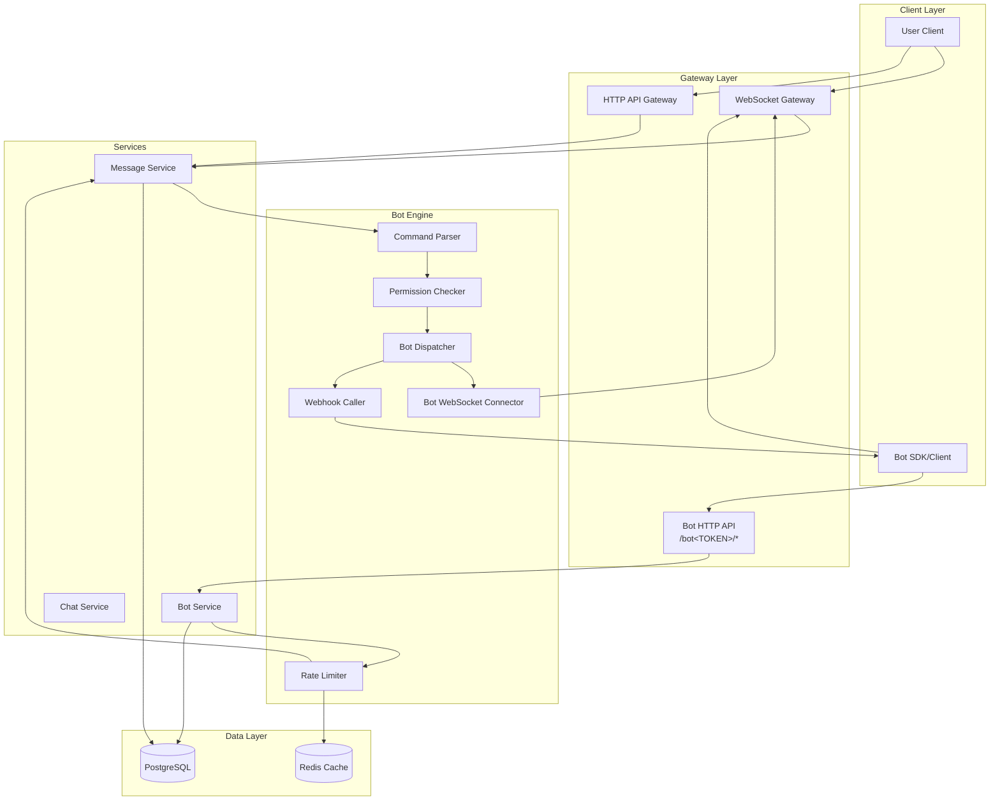

# Design Document: Bot Engine

## Overview

Bot Engine là hệ thống cho phép tạo và quản lý các bot tự động trong ứng dụng chat, tương tự Telegram Bot API. Hệ thống bao gồm:

- Bot registration và management với token-based authentication
- Dual delivery: WebSocket realtime và webhook fallback
- Command parsing với shell-style quoting
- Permission-based access control
- Rate limiting để prevent abuse

## Architecture



## Components and Interfaces

### 1. Bot Model

```rust
// backend/src/models/bot.rs

use chrono::{DateTime, Utc};
use serde::{Deserialize, Serialize};
use sqlx::FromRow;
use uuid::Uuid;

#[derive(Debug, Clone, Serialize, Deserialize, FromRow)]
pub struct Bot {
    pub id: Uuid,
    pub name: String,
    pub token: String,
    pub owner_id: Uuid,
    pub webhook_url: Option<String>,
    pub is_active: bool,
    pub created_at: DateTime<Utc>,
    pub updated_at: DateTime<Utc>,
}

#[derive(Debug, Clone, Serialize, Deserialize, FromRow)]
pub struct BotPermission {
    pub bot_id: Uuid,
    pub scope: String,
}

#[derive(Debug, Clone, Serialize, Deserialize, FromRow)]
pub struct BotChat {
    pub bot_id: Uuid,
    pub chat_id: Uuid,
    pub added_at: DateTime<Utc>,
}

#[derive(Debug, Clone, Serialize, Deserialize)]
pub struct BotResponse {
    pub id: Uuid,
    pub name: String,
    pub token: String,
    #[serde(rename = "webhookUrl")]
    pub webhook_url: Option<String>,
    #[serde(rename = "isActive")]
    pub is_active: bool,
    #[serde(rename = "createdAt")]
    pub created_at: DateTime<Utc>,
}

#[derive(Debug, Clone, Serialize, Deserialize)]
pub struct CreateBotRequest {
    pub name: String,
}

#[derive(Debug, Clone, Serialize, Deserialize)]
pub struct SetWebhookRequest {
    pub url: Option<String>,
}

#[derive(Debug, Clone, Serialize, Deserialize)]
pub struct BotSendMessageRequest {
    pub chat_id: Uuid,
    pub text: String,
    #[serde(rename = "replyToId")]
    pub reply_to_id: Option<Uuid>,
    #[serde(rename = "inlineKeyboard")]
    pub inline_keyboard: Option<Vec<Vec<InlineButton>>>,
}

#[derive(Debug, Clone, Serialize, Deserialize)]
pub struct InlineButton {
    pub text: String,
    #[serde(rename = "callbackData")]
    pub callback_data: Option<String>,
    pub url: Option<String>,
}
```

### 2. Command Parser

```rust
// backend/src/services/bot_engine/command_parser.rs

#[derive(Debug, Clone, PartialEq)]
pub struct ParsedCommand {
    pub command: String,
    pub args: Vec<String>,
}

impl ParsedCommand {
    /// Parse a message text into a command and arguments
    /// Returns None if the message doesn't start with '/'
    pub fn parse(text: &str) -> Option<Self> {
        let text = text.trim();
        if !text.starts_with('/') {
            return None;
        }

        let content = &text[1..];
        if content.is_empty() {
            return None;
        }

        // Use shell_words for proper argument parsing
        let parts = shell_words::split(content).ok()?;
        if parts.is_empty() {
            return None;
        }

        let command = parts[0].to_lowercase();
        let args = parts[1..].to_vec();

        Some(ParsedCommand { command, args })
    }
}
```

### 3. Bot Dispatcher

```rust
// backend/src/services/bot_engine/dispatcher.rs

use uuid::Uuid;

pub struct CommandContext {
    pub user_id: Uuid,
    pub chat_id: Uuid,
    pub message_id: Uuid,
    pub text: String,
    pub command: Option<ParsedCommand>,
}

pub struct BotDispatcher {
    ws_manager: Arc<WsManager>,
    http_client: reqwest::Client,
}

impl BotDispatcher {
    /// Dispatch message to all active bots subscribed to the chat
    pub async fn dispatch(&self, ctx: &CommandContext, bots: Vec<Bot>) -> Result<(), AppError> {
        for bot in bots {
            if !bot.is_active {
                continue;
            }
            
            // Try WebSocket first, fallback to webhook
            if !self.send_via_websocket(&bot, ctx).await {
                self.send_via_webhook(&bot, ctx).await?;
            }
        }
        Ok(())
    }

    async fn send_via_websocket(&self, bot: &Bot, ctx: &CommandContext) -> bool {
        // Check if bot has active WebSocket connection
        // Send BotUpdate event if connected
        // Return true if sent successfully
    }

    async fn send_via_webhook(&self, bot: &Bot, ctx: &CommandContext) -> Result<(), AppError> {
        if let Some(webhook_url) = &bot.webhook_url {
            let payload = WebhookPayload {
                update_id: ctx.message_id,
                message: WebhookMessage {
                    chat: WebhookChat { id: ctx.chat_id },
                    from: WebhookUser { id: ctx.user_id },
                    text: ctx.text.clone(),
                },
            };

            self.http_client
                .post(webhook_url)
                .json(&payload)
                .timeout(Duration::from_secs(5))
                .send()
                .await?;
        }
        Ok(())
    }
}
```

### 4. Permission Checker

```rust
// backend/src/services/bot_engine/permission.rs

pub const SCOPE_SEND_MESSAGE: &str = "send_message";
pub const SCOPE_READ_MESSAGE: &str = "read_message";
pub const SCOPE_BAN_USER: &str = "ban_user";

pub struct PermissionChecker;

impl PermissionChecker {
    pub async fn check_scope(db: &Database, bot_id: Uuid, scope: &str) -> Result<bool, AppError> {
        let result: Option<(i64,)> = sqlx::query_as(
            "SELECT 1 FROM bot_permissions WHERE bot_id = $1 AND scope = $2"
        )
        .bind(bot_id)
        .bind(scope)
        .fetch_optional(&db.pool)
        .await?;

        Ok(result.is_some())
    }

    pub async fn check_chat_subscription(
        db: &Database, 
        bot_id: Uuid, 
        chat_id: Uuid
    ) -> Result<bool, AppError> {
        let result: Option<(i64,)> = sqlx::query_as(
            "SELECT 1 FROM bot_chats WHERE bot_id = $1 AND chat_id = $2"
        )
        .bind(bot_id)
        .bind(chat_id)
        .fetch_optional(&db.pool)
        .await?;

        Ok(result.is_some())
    }
}
```

### 5. Rate Limiter

```rust
// backend/src/services/bot_engine/rate_limiter.rs

use redis::AsyncCommands;

pub struct RateLimiter {
    redis: redis::aio::ConnectionManager,
    requests_per_minute: u32,
}

impl RateLimiter {
    pub async fn check_rate_limit(&self, bot_id: Uuid) -> Result<RateLimitResult, AppError> {
        let key = format!("bot_rate_limit:{}", bot_id);
        let count: u32 = self.redis.get(&key).await.unwrap_or(0);

        if count >= self.requests_per_minute {
            let ttl: i64 = self.redis.ttl(&key).await.unwrap_or(60);
            return Ok(RateLimitResult::Exceeded { retry_after: ttl as u32 });
        }

        // Increment counter
        let _: () = self.redis.incr(&key, 1).await?;
        if count == 0 {
            let _: () = self.redis.expire(&key, 60).await?;
        }

        Ok(RateLimitResult::Allowed { remaining: self.requests_per_minute - count - 1 })
    }
}

pub enum RateLimitResult {
    Allowed { remaining: u32 },
    Exceeded { retry_after: u32 },
}
```

### 6. Bot WebSocket Events

```rust
// backend/src/ws/events.rs (additions)

/// Bot-specific server events
#[derive(Debug, Clone, Serialize, Deserialize)]
#[serde(tag = "event", content = "data")]
pub enum BotServerEvent {
    /// Update sent to bot (message in subscribed chat)
    BotUpdate {
        #[serde(rename = "updateId")]
        update_id: Uuid,
        message: BotUpdateMessage,
    },
    /// Bot authenticated successfully
    BotConnected {
        #[serde(rename = "botId")]
        bot_id: Uuid,
        #[serde(rename = "botName")]
        bot_name: String,
    },
}

#[derive(Debug, Clone, Serialize, Deserialize)]
pub struct BotUpdateMessage {
    pub chat: BotUpdateChat,
    pub from: BotUpdateUser,
    pub text: String,
    #[serde(rename = "messageId")]
    pub message_id: Uuid,
}

#[derive(Debug, Clone, Serialize, Deserialize)]
pub struct BotUpdateChat {
    pub id: Uuid,
}

#[derive(Debug, Clone, Serialize, Deserialize)]
pub struct BotUpdateUser {
    pub id: Uuid,
}
```

### 7. Bot HTTP API Routes

```rust
// backend/src/routes/bot_api.rs

pub fn bot_api_routes() -> Router<Arc<AppState>> {
    Router::new()
        .route("/bot:token/sendMessage", post(send_message))
        .route("/bot:token/setWebhook", post(set_webhook))
        .route("/bot:token/getMe", get(get_me))
        .route("/bot:token/getUpdates", get(get_updates))
}

async fn send_message(
    State(state): State<Arc<AppState>>,
    Path(token): Path<String>,
    Json(body): Json<BotSendMessageRequest>,
) -> Result<Json<MessageResponse>, AppError> {
    // 1. Validate token and get bot
    // 2. Check rate limit
    // 3. Check chat subscription
    // 4. Check send_message permission
    // 5. Create message with sender = Bot(bot_id)
    // 6. Broadcast via WebSocket
}
```

## Data Models

### Database Schema

```sql
-- Bot table
CREATE TABLE bots (
    id UUID PRIMARY KEY DEFAULT gen_random_uuid(),
    name TEXT NOT NULL,
    token TEXT UNIQUE NOT NULL,
    owner_id UUID NOT NULL REFERENCES users(id) ON DELETE CASCADE,
    webhook_url TEXT,
    is_active BOOLEAN DEFAULT true,
    created_at TIMESTAMP WITH TIME ZONE DEFAULT NOW(),
    updated_at TIMESTAMP WITH TIME ZONE DEFAULT NOW()
);

CREATE INDEX idx_bots_token ON bots(token);
CREATE INDEX idx_bots_owner ON bots(owner_id);

-- Bot permissions table
CREATE TABLE bot_permissions (
    bot_id UUID NOT NULL REFERENCES bots(id) ON DELETE CASCADE,
    scope TEXT NOT NULL,
    PRIMARY KEY (bot_id, scope)
);

-- Bot chat subscriptions table
CREATE TABLE bot_chats (
    bot_id UUID NOT NULL REFERENCES bots(id) ON DELETE CASCADE,
    chat_id UUID NOT NULL REFERENCES chats(id) ON DELETE CASCADE,
    added_at TIMESTAMP WITH TIME ZONE DEFAULT NOW(),
    PRIMARY KEY (bot_id, chat_id)
);

CREATE INDEX idx_bot_chats_chat ON bot_chats(chat_id);
```

### Message Sender Type

Extend the message model to support bot senders:

```rust
#[derive(Debug, Clone, Serialize, Deserialize)]
#[serde(tag = "type")]
pub enum MessageSender {
    User { id: Uuid },
    Bot { id: Uuid },
}
```


## Correctness Properties

*A property is a characteristic or behavior that should hold true across all valid executions of a system-essentially, a formal statement about what the system should do. Properties serve as the bridge between human-readable specifications and machine-verifiable correctness guarantees.*


### Property 1: Bot Creation Produces Valid Bot with Owner and Default Permissions

*For any* valid bot name and user, creating a bot SHALL produce a bot with:
- A unique, non-empty token
- owner_id matching the creating user
- is_active set to true
- Exactly one permission: "send_message"

**Validates: Requirements 1.1, 1.2, 3.1**

### Property 2: Bot Activation Round-Trip

*For any* active bot, deactivating then reactivating SHALL restore the bot to is_active=true state, and the bot should be equivalent to its original state.

**Validates: Requirements 1.3, 1.4**

### Property 3: Bot Deletion Cascades to Related Records

*For any* bot with permissions and chat subscriptions, deleting the bot SHALL remove:
- The bot record
- All bot_permissions records for that bot
- All bot_chats records for that bot

**Validates: Requirements 1.5**

### Property 4: Webhook URL Management

*For any* bot:
- Setting a valid URL SHALL update webhook_url to that URL
- Setting an empty/null URL SHALL clear webhook_url to None
- Setting an invalid URL format SHALL return an error and leave webhook_url unchanged

**Validates: Requirements 2.1, 2.2, 2.3**

### Property 5: Permission Grant and Revoke

*For any* bot and valid scope:
- Granting a scope SHALL add it to bot_permissions
- Revoking a scope SHALL remove it from bot_permissions
- Granting then revoking SHALL result in the scope not being present

**Validates: Requirements 3.2, 3.3**

### Property 6: Permission Enforcement

*For any* bot attempting an action requiring a scope:
- If the bot has the scope, the action SHALL succeed
- If the bot lacks the scope, the action SHALL fail with a permission error

**Validates: Requirements 3.4, 3.5**

### Property 7: Chat Subscription Management

*For any* bot and chat:
- Adding a bot to a chat SHALL create a bot_chats record
- Removing a bot from a chat SHALL delete the bot_chats record
- Adding then removing SHALL result in no subscription

**Validates: Requirements 4.1, 4.2**

### Property 8: Subscription Enforcement

*For any* bot attempting to send a message to a chat:
- If the bot is subscribed to the chat, the message SHALL be created
- If the bot is not subscribed, the request SHALL fail with a forbidden error

**Validates: Requirements 4.3, 4.4, 7.6**

### Property 9: Command Parsing

*For any* message text:
- If it starts with "/", parsing SHALL extract the command (lowercase) and arguments
- If it doesn't start with "/", parsing SHALL return None
- Arguments with shell-style quoting SHALL be parsed correctly (e.g., `/cmd "arg with spaces"` → args: ["arg with spaces"])
- Command names SHALL be case-insensitive (e.g., "/HELP" → command: "help")

**Validates: Requirements 5.1, 5.2, 5.3, 5.4**

### Property 10: Active Bot Filtering for Dispatch

*For any* chat with multiple bots (some active, some inactive), dispatching a command SHALL only deliver to active bots that are subscribed to the chat.

**Validates: Requirements 6.2, 6.3**

### Property 11: Webhook Payload Structure

*For any* webhook payload, it SHALL contain:
- update_id (message ID)
- message.chat.id (chat UUID)
- message.from.id (sender UUID)
- message.text (message content)

**Validates: Requirements 6.5**

### Property 12: Bot Token Authentication

*For any* API request with a bot token:
- A valid token SHALL identify the correct bot
- An invalid token SHALL return an authentication error

**Validates: Requirements 7.2, 7.5**

### Property 13: Bot Message Sender Type

*For any* message created by a bot, the sender SHALL be marked as Bot(bot_id) with the correct bot ID.

**Validates: Requirements 7.3**

### Property 14: Rate Limiting

*For any* bot making API requests:
- Requests within the limit SHALL succeed
- Requests exceeding the limit SHALL fail with a rate limit error containing retry_after
- After the time window resets, requests SHALL succeed again

**Validates: Requirements 8.1, 8.2, 8.3, 8.4**

### Property 15: WebSocket Delivery Preference

*For any* bot with both webhook and WebSocket configured, message delivery SHALL prefer WebSocket over webhook.

**Validates: Requirements 9.4**

### Property 16: Payload Format Consistency

*For any* message update, the WebSocket payload format SHALL be equivalent to the webhook payload format.

**Validates: Requirements 9.6**

### Property 17: Message Serialization Round-Trip

*For any* valid bot message, serializing to JSON then deserializing SHALL produce an equivalent message object.

**Validates: Requirements 10.3**

## Error Handling

### Error Types

```rust
#[derive(Debug, thiserror::Error)]
pub enum BotError {
    #[error("Bot not found")]
    BotNotFound,
    
    #[error("Invalid bot token")]
    InvalidToken,
    
    #[error("Bot is not active")]
    BotInactive,
    
    #[error("Bot not subscribed to chat")]
    NotSubscribed,
    
    #[error("Permission denied: missing scope {0}")]
    PermissionDenied(String),
    
    #[error("Rate limit exceeded, retry after {0} seconds")]
    RateLimitExceeded(u32),
    
    #[error("Invalid webhook URL")]
    InvalidWebhookUrl,
    
    #[error("Webhook unreachable")]
    WebhookUnreachable,
    
    #[error("Database error: {0}")]
    Database(#[from] sqlx::Error),
}
```

### Error Response Format

```json
{
  "ok": false,
  "error_code": 403,
  "description": "Bot not subscribed to chat"
}
```

## Testing Strategy

### Unit Tests

Unit tests sẽ cover:
- Command parser với các edge cases (empty string, only slash, special characters)
- Permission checker logic
- Rate limiter counter logic
- Webhook payload serialization

### Property-Based Tests

Sử dụng `proptest` crate (đã có trong Cargo.toml) để implement các correctness properties:

```rust
use proptest::prelude::*;

proptest! {
    #[test]
    fn test_command_parsing_roundtrip(command in "[a-z]{1,10}", args in prop::collection::vec("[a-zA-Z0-9]+", 0..5)) {
        // Property 9: Command Parsing
        let text = format!("/{} {}", command, args.join(" "));
        let parsed = ParsedCommand::parse(&text);
        prop_assert!(parsed.is_some());
        let parsed = parsed.unwrap();
        prop_assert_eq!(parsed.command, command.to_lowercase());
    }

    #[test]
    fn test_message_serialization_roundtrip(message in any::<BotMessage>()) {
        // Property 17: Message Serialization Round-Trip
        let json = serde_json::to_string(&message).unwrap();
        let deserialized: BotMessage = serde_json::from_str(&json).unwrap();
        prop_assert_eq!(message, deserialized);
    }
}
```

### Integration Tests

Integration tests sẽ cover:
- Full bot creation flow
- WebSocket connection và message delivery
- Webhook calling
- Rate limiting với Redis

### Test Configuration

- Property tests: minimum 100 iterations
- Each property test tagged with: `Feature: bot-engine, Property N: {property_text}`
