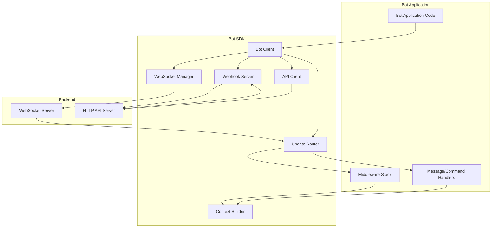

# Design Document: Bot SDK (TypeScript)

## Overview

Bot SDK là một TypeScript library cho phép developers xây dựng bot một cách dễ dàng. SDK cung cấp:

- **Dual-mode support**: WebSocket (realtime) và Webhook (serverless-friendly)
- **Type-safe API**: Full TypeScript definitions với IntelliSense
- **Middleware architecture**: Extensible với logging, auth, rate limiting
- **Auto-reconnect**: Resilient WebSocket với exponential backoff
- **Retry logic**: Automatic retry cho API requests
- **Developer-friendly**: Fluent API giống Telegraf.js

## Architecture



## Components and Interfaces

### 1. Bot Client

Main entry point của SDK:

```typescript
// src/bot.ts

export interface BotOptions {
  token: string;
  mode?: 'websocket' | 'webhook';
  apiBaseUrl?: string;
  wsUrl?: string;
  logLevel?: 'debug' | 'info' | 'error' | 'none';
  logger?: Logger;
  retryAttempts?: number;
  retryDelay?: number;
}

export class Bot {
  private token: string;
  private options: Required<BotOptions>;
  private wsManager?: WebSocketManager;
  private webhookServer?: WebhookServer;
  private apiClient: ApiClient;
  private updateRouter: UpdateRouter;
  private eventEmitter: EventEmitter;
  private isRunning: boolean = false;

  constructor(token: string, options?: Partial<BotOptions>) {
    if (!token || token.trim() === '') {
      throw new Error('Bot token is required and must be non-empty');
    }

    this.token = token;
    this.options = {
      token,
      mode: options?.mode ?? 'websocket',
      apiBaseUrl: options?.apiBaseUrl ?? 'http://localhost:3000',
      wsUrl: options?.wsUrl ?? 'ws://localhost:3000',
      logLevel: options?.logLevel ?? 'info',
      logger: options?.logger ?? new ConsoleLogger(),
      retryAttempts: options?.retryAttempts ?? 3,
      retryDelay: options?.retryDelay ?? 1000,
    };

    this.apiClient = new ApiClient(this.token, this.options);
    this.updateRouter = new UpdateRouter(this.apiClient, this.options.logger);
    this.eventEmitter = new EventEmitter();
  }

  // Start bot in WebSocket mode
  async start(): Promise<void> {
    if (this.isRunning) {
      throw new Error('Bot is already running');
    }

    if (this.options.mode === 'websocket') {
      this.wsManager = new WebSocketManager(
        this.token,
        this.options.wsUrl,
        this.updateRouter,
        this.options.logger
      );
      await this.wsManager.connect();
    } else {
      throw new Error('Use startWebhook() for webhook mode');
    }

    this.isRunning = true;
    this.emit('ready');
  }

  // Start bot in webhook mode
  async startWebhook(port: number, path: string = '/webhook'): Promise<void> {
    if (this.isRunning) {
      throw new Error('Bot is already running');
    }

    if (this.options.mode === 'webhook') {
      this.webhookServer = new WebhookServer(
        port,
        path,
        this.updateRouter,
        this.options.logger
      );
      await this.webhookServer.start();
    } else {
      throw new Error('Use start() for websocket mode');
    }

    this.isRunning = true;
    this.emit('ready');
  }

  // Stop bot gracefully
  async stop(): Promise<void> {
    if (!this.isRunning) {
      return;
    }

    this.isRunning = false;

    if (this.wsManager) {
      await this.wsManager.disconnect();
    }

    if (this.webhookServer) {
      await this.webhookServer.stop();
    }

    this.emit('stopped');
  }

  // Register message handler
  on(event: 'message', handler: MessageHandler): void;
  on(event: 'text', handler: TextHandler): void;
  on(event: 'command', handler: CommandHandler): void;
  on(event: 'error', handler: ErrorHandler): void;
  on(event: 'ready' | 'stopped', handler: () => void): void;
  on(event: string, handler: any): void {
    if (event === 'message' || event === 'text' || event === 'command') {
      this.updateRouter.on(event, handler);
    } else {
      this.eventEmitter.on(event, handler);
    }
  }

  // Register command handler
  command(command: string, handler: CommandHandler): void {
    this.updateRouter.command(command, handler);
  }

  // Register middleware
  use(middleware: Middleware): void {
    this.updateRouter.use(middleware);
  }

  // Send message
  async sendMessage(
    chatId: string,
    text: string,
    options?: SendMessageOptions
  ): Promise<Message> {
    return this.apiClient.sendMessage(chatId, text, options);
  }

  // Helper methods
  private emit(event: string, ...args: any[]): void {
    this.eventEmitter.emit(event, ...args);
  }
}
```

### 2. WebSocket Manager

Quản lý WebSocket connection với auto-reconnect:

```typescript
// src/websocket-manager.ts

export class WebSocketManager {
  private ws?: WebSocket;
  private token: string;
  private wsUrl: string;
  private updateRouter: UpdateRouter;
  private logger: Logger;
  private reconnectAttempts: number = 0;
  private maxReconnectAttempts: number = 10;
  private reconnectDelay: number = 1000;
  private isConnected: boolean = false;
  private shouldReconnect: boolean = true;
  private lastUpdateId?: string;

  constructor(
    token: string,
    wsUrl: string,
    updateRouter: UpdateRouter,
    logger: Logger
  ) {
    this.token = token;
    this.wsUrl = wsUrl;
    this.updateRouter = updateRouter;
    this.logger = logger;
  }

  async connect(): Promise<void> {
    return new Promise((resolve, reject) => {
      const url = `${this.wsUrl}?token=${this.token}`;
      this.ws = new WebSocket(url);

      this.ws.on('open', () => {
        this.logger.info('WebSocket connected');
        this.isConnected = true;
        this.reconnectAttempts = 0;
        resolve();
      });

      this.ws.on('message', (data: string) => {
        this.handleMessage(data);
      });

      this.ws.on('close', () => {
        this.logger.info('WebSocket closed');
        this.isConnected = false;
        if (this.shouldReconnect) {
          this.scheduleReconnect();
        }
      });

      this.ws.on('error', (error) => {
        this.logger.error('WebSocket error:', error);
        if (!this.isConnected) {
          reject(error);
        }
      });
    });
  }

  async disconnect(): Promise<void> {
    this.shouldReconnect = false;
    if (this.ws) {
      this.ws.close();
      this.ws = undefined;
    }
  }

  private handleMessage(data: string): void {
    try {
      const event = JSON.parse(data);
      
      if (event.event === 'BotUpdate') {
        const update: Update = {
          updateId: event.data.updateId,
          message: event.data.message,
        };
        
        this.lastUpdateId = update.updateId;
        this.updateRouter.route(update);
      } else if (event.event === 'BotConnected') {
        this.logger.info('Bot authenticated:', event.data.botName);
      }
    } catch (error) {
      this.logger.error('Failed to parse message:', error);
    }
  }

  private scheduleReconnect(): void {
    if (this.reconnectAttempts >= this.maxReconnectAttempts) {
      this.logger.error('Max reconnect attempts reached');
      return;
    }

    const delay = this.reconnectDelay * Math.pow(2, this.reconnectAttempts);
    this.reconnectAttempts++;

    this.logger.info(`Reconnecting in ${delay}ms (attempt ${this.reconnectAttempts})`);

    setTimeout(() => {
      this.connect().catch((error) => {
        this.logger.error('Reconnect failed:', error);
      });
    }, delay);
  }
}
```

### 3. Webhook Server

HTTP server cho webhook mode:

```typescript
// src/webhook-server.ts

import express, { Express, Request, Response } from 'express';
import { Server } from 'http';

export class WebhookServer {
  private app: Express;
  private server?: Server;
  private port: number;
  private path: string;
  private updateRouter: UpdateRouter;
  private logger: Logger;

  constructor(
    port: number,
    path: string,
    updateRouter: UpdateRouter,
    logger: Logger
  ) {
    this.port = port;
    this.path = path;
    this.updateRouter = updateRouter;
    this.logger = logger;
    this.app = express();
    this.app.use(express.json());
  }

  async start(): Promise<void> {
    return new Promise((resolve) => {
      this.app.post(this.path, (req: Request, res: Response) => {
        this.handleWebhook(req, res);
      });

      this.server = this.app.listen(this.port, () => {
        this.logger.info(`Webhook server listening on port ${this.port}`);
        resolve();
      });
    });
  }

  async stop(): Promise<void> {
    return new Promise((resolve) => {
      if (this.server) {
        this.server.close(() => {
          this.logger.info('Webhook server stopped');
          resolve();
        });
      } else {
        resolve();
      }
    });
  }

  private handleWebhook(req: Request, res: Response): void {
    try {
      const update: Update = req.body;

      if (!update.updateId || !update.message) {
        res.status(400).json({ error: 'Invalid update payload' });
        return;
      }

      this.updateRouter.route(update);
      res.status(200).json({ ok: true });
    } catch (error) {
      this.logger.error('Webhook error:', error);
      res.status(500).json({ error: 'Internal server error' });
    }
  }
}
```

### 4. API Client

HTTP client cho Bot API với retry logic:

```typescript
// src/api-client.ts

import axios, { AxiosInstance, AxiosError } from 'axios';

export class ApiClient {
  private token: string;
  private client: AxiosInstance;
  private retryAttempts: number;
  private retryDelay: number;
  private logger: Logger;

  constructor(token: string, options: BotOptions) {
    this.token = token;
    this.retryAttempts = options.retryAttempts;
    this.retryDelay = options.retryDelay;
    this.logger = options.logger;

    this.client = axios.create({
      baseURL: options.apiBaseUrl,
      timeout: 10000,
    });
  }

  async sendMessage(
    chatId: string,
    text: string,
    options?: SendMessageOptions
  ): Promise<Message> {
    const url = `/bot${this.token}/sendMessage`;
    const payload = {
      chat_id: chatId,
      text,
      reply_to_id: options?.replyToId,
      inline_keyboard: options?.inlineKeyboard,
    };

    return this.requestWithRetry('POST', url, payload);
  }

  private async requestWithRetry(
    method: string,
    url: string,
    data?: any,
    attempt: number = 0
  ): Promise<any> {
    try {
      const response = await this.client.request({ method, url, data });
      return response.data;
    } catch (error) {
      if (axios.isAxiosError(error)) {
        const axiosError = error as AxiosError;

        // Rate limit error - wait and retry
        if (axiosError.response?.status === 429) {
          const retryAfter = (axiosError.response.data as any)?.retry_after ?? 60;
          this.logger.info(`Rate limited, retrying after ${retryAfter}s`);
          await this.sleep(retryAfter * 1000);
          return this.requestWithRetry(method, url, data, attempt);
        }

        // Client error (4xx) - don't retry
        if (axiosError.response && axiosError.response.status >= 400 && axiosError.response.status < 500) {
          throw new BotError(
            axiosError.response.data as any,
            axiosError.response.status
          );
        }

        // Network error or 5xx - retry
        if (attempt < this.retryAttempts) {
          const delay = this.retryDelay * Math.pow(2, attempt);
          this.logger.info(`Request failed, retrying in ${delay}ms (attempt ${attempt + 1})`);
          await this.sleep(delay);
          return this.requestWithRetry(method, url, data, attempt + 1);
        }
      }

      throw error;
    }
  }

  private sleep(ms: number): Promise<void> {
    return new Promise((resolve) => setTimeout(resolve, ms));
  }
}
```

### 5. Update Router

Điều phối updates đến handlers và middleware:

```typescript
// src/update-router.ts

export type Middleware = (ctx: Context, next: () => Promise<void>) => Promise<void>;
export type MessageHandler = (ctx: Context) => Promise<void> | void;
export type TextHandler = (ctx: Context) => Promise<void> | void;
export type CommandHandler = (ctx: Context) => Promise<void> | void;
export type ErrorHandler = (error: Error, ctx?: Context) => void;

export class UpdateRouter {
  private middlewares: Middleware[] = [];
  private messageHandlers: MessageHandler[] = [];
  private textHandlers: TextHandler[] = [];
  private commandHandlers: Map<string, CommandHandler[]> = new Map();
  private generalCommandHandlers: CommandHandler[] = [];
  private errorHandlers: ErrorHandler[] = [];
  private apiClient: ApiClient;
  private logger: Logger;

  constructor(apiClient: ApiClient, logger: Logger) {
    this.apiClient = apiClient;
    this.logger = logger;
  }

  on(event: 'message', handler: MessageHandler): void;
  on(event: 'text', handler: TextHandler): void;
  on(event: 'command', handler: CommandHandler): void;
  on(event: string, handler: any): void {
    if (event === 'message') {
      this.messageHandlers.push(handler);
    } else if (event === 'text') {
      this.textHandlers.push(handler);
    } else if (event === 'command') {
      this.generalCommandHandlers.push(handler);
    }
  }

  command(command: string, handler: CommandHandler): void {
    const normalizedCommand = command.toLowerCase();
    if (!this.commandHandlers.has(normalizedCommand)) {
      this.commandHandlers.set(normalizedCommand, []);
    }
    this.commandHandlers.get(normalizedCommand)!.push(handler);
  }

  use(middleware: Middleware): void {
    this.middlewares.push(middleware);
  }

  onError(handler: ErrorHandler): void {
    this.errorHandlers.push(handler);
  }

  async route(update: Update): Promise<void> {
    try {
      const ctx = new Context(update, this.apiClient);

      // Run middleware chain
      let middlewareIndex = 0;
      const runMiddleware = async (): Promise<void> => {
        if (middlewareIndex < this.middlewares.length) {
          const middleware = this.middlewares[middlewareIndex++];
          await middleware(ctx, runMiddleware);
        } else {
          // Middleware chain complete, run handlers
          await this.runHandlers(ctx);
        }
      };

      await runMiddleware();
    } catch (error) {
      this.handleError(error as Error);
    }
  }

  private async runHandlers(ctx: Context): Promise<void> {
    // Always run message handlers
    for (const handler of this.messageHandlers) {
      try {
        await handler(ctx);
      } catch (error) {
        this.handleError(error as Error, ctx);
      }
    }

    // Check if it's a command
    const parsedCommand = this.parseCommand(ctx.message.text);
    if (parsedCommand) {
      ctx.command = parsedCommand.command;
      ctx.args = parsedCommand.args;

      // Run specific command handlers
      const handlers = this.commandHandlers.get(parsedCommand.command) ?? [];
      for (const handler of handlers) {
        try {
          await handler(ctx);
        } catch (error) {
          this.handleError(error as Error, ctx);
        }
      }

      // Run general command handlers
      for (const handler of this.generalCommandHandlers) {
        try {
          await handler(ctx);
        } catch (error) {
          this.handleError(error as Error, ctx);
        }
      }
    } else if (ctx.message.text) {
      // Run text handlers for non-command text messages
      for (const handler of this.textHandlers) {
        try {
          await handler(ctx);
        } catch (error) {
          this.handleError(error as Error, ctx);
        }
      }
    }
  }

  private parseCommand(text: string): { command: string; args: string[] } | null {
    const trimmed = text.trim();
    if (!trimmed.startsWith('/')) {
      return null;
    }

    const content = trimmed.slice(1);
    if (content.length === 0) {
      return null;
    }

    const parts = content.split(/\s+/);
    const command = parts[0].toLowerCase();
    const args = parts.slice(1);

    return { command, args };
  }

  private handleError(error: Error, ctx?: Context): void {
    if (this.errorHandlers.length > 0) {
      for (const handler of this.errorHandlers) {
        try {
          handler(error, ctx);
        } catch (handlerError) {
          this.logger.error('Error in error handler:', handlerError);
        }
      }
    } else {
      this.logger.error('Unhandled error:', error);
    }
  }
}
```

### 6. Context

Context object cung cấp cho handlers:

```typescript
// src/context.ts

export class Context {
  public message: Message;
  public updateId: string;
  public command?: string;
  public args?: string[];
  private apiClient: ApiClient;

  constructor(update: Update, apiClient: ApiClient) {
    this.updateId = update.updateId;
    this.message = update.message;
    this.apiClient = apiClient;
  }

  // Reply to the message
  async reply(text: string, options?: SendMessageOptions): Promise<Message> {
    return this.apiClient.sendMessage(
      this.message.chat.id,
      text,
      {
        ...options,
        replyToId: this.message.messageId,
      }
    );
  }

  // Reply with inline keyboard
  async replyWithButtons(
    text: string,
    buttons: InlineButton[][]
  ): Promise<Message> {
    return this.apiClient.sendMessage(
      this.message.chat.id,
      text,
      {
        replyToId: this.message.messageId,
        inlineKeyboard: buttons,
      }
    );
  }

  // Send message to the same chat
  async send(text: string, options?: SendMessageOptions): Promise<Message> {
    return this.apiClient.sendMessage(this.message.chat.id, text, options);
  }

  // Getters for convenience
  get chatId(): string {
    return this.message.chat.id;
  }

  get userId(): string {
    return this.message.from.id;
  }

  get text(): string {
    return this.message.text;
  }
}
```

## Data Models

### TypeScript Types

```typescript
// src/types.ts

export interface Update {
  updateId: string;
  message: Message;
}

export interface Message {
  messageId: string;
  chat: Chat;
  from: User;
  text: string;
  timestamp?: string;
}

export interface Chat {
  id: string;
  type?: 'private' | 'group';
}

export interface User {
  id: string;
  username?: string;
}

export interface InlineButton {
  text: string;
  callbackData?: string;
  url?: string;
}

export interface SendMessageOptions {
  replyToId?: string;
  inlineKeyboard?: InlineButton[][];
}

export interface BotError {
  ok: false;
  errorCode: number;
  description: string;
}

export interface Logger {
  debug(message: string, ...args: any[]): void;
  info(message: string, ...args: any[]): void;
  error(message: string, ...args: any[]): void;
}

export class ConsoleLogger implements Logger {
  constructor(private level: 'debug' | 'info' | 'error' | 'none' = 'info') {}

  debug(message: string, ...args: any[]): void {
    if (this.level === 'debug') {
      console.debug(`[DEBUG] ${message}`, ...args);
    }
  }

  info(message: string, ...args: any[]): void {
    if (this.level === 'debug' || this.level === 'info') {
      console.info(`[INFO] ${message}`, ...args);
    }
  }

  error(message: string, ...args: any[]): void {
    if (this.level !== 'none') {
      console.error(`[ERROR] ${message}`, ...args);
    }
  }
}
```


## Correctness Properties

*A property is a characteristic or behavior that should hold true across all valid executions of a system-essentially, a formal statement about what the system should do. Properties serve as the bridge between human-readable specifications and machine-verifiable correctness guarantees.*

### Property Reflection

After analyzing all acceptance criteria, I identified the following redundancies:
- Properties 1.1 and 1.2 can be combined into a single "Bot initialization preserves configuration" property
- Properties 6.2, 6.3, 6.4, 6.5 can be combined into "Context provides required fields and methods"
- Properties 7.2 and 7.3 can be combined into "Message payload includes required and optional fields"
- Properties 8.3 and 8.4 can be combined into "Button fields are preserved"
- Properties 15.1-15.4 can be combined into "Log level controls output"

### Property 1: Bot Initialization Validates and Stores Configuration

*For any* valid token and connection options, creating a Bot instance SHALL:
- Store the token for authentication
- Store the API base URL and WebSocket URL
- Reject empty or invalid tokens with an error

**Validates: Requirements 1.1, 1.2, 1.4, 1.5**

### Property 2: Exponential Backoff for Reconnection

*For any* WebSocket connection that drops, reconnection attempts SHALL follow exponential backoff pattern where delay = baseDelay * 2^attemptNumber.

**Validates: Requirements 2.5**

### Property 3: Update ID Tracking Across Reconnects

*For any* sequence of updates processed before disconnect, reconnecting SHALL resume from the last processed update_id.

**Validates: Requirements 2.6**

### Property 4: Webhook Payload Parsing

*For any* valid update payload received by webhook server, parsing SHALL extract updateId and message fields correctly.

**Validates: Requirements 3.2**

### Property 5: Webhook Error Responses

*For any* invalid payload received by webhook server, the response SHALL be HTTP 400, and for any valid payload, the response SHALL be HTTP 200.

**Validates: Requirements 3.4, 3.5**

### Property 6: Handler Registration and Invocation Order

*For any* sequence of handlers registered for the same event, they SHALL be called in registration order when that event occurs.

**Validates: Requirements 4.1, 4.2, 4.3, 4.4**

### Property 7: Error Isolation in Handlers

*For any* handler that throws an error, the SDK SHALL catch it, emit an "error" event, and continue calling remaining handlers.

**Validates: Requirements 4.5, 10.1**

### Property 8: Command Registration and Case-Insensitive Matching

*For any* command registered with bot.command(name, handler), messages starting with "/" followed by that command name (case-insensitive) SHALL trigger the handler.

**Validates: Requirements 5.1, 5.2, 5.4**

### Property 9: Command Context Construction

*For any* command message, the Context provided to command handlers SHALL include:
- command field with the lowercase command name
- args field with parsed arguments

**Validates: Requirements 5.3, 6.5**

### Property 10: Unmatched Command Fallback

*For any* command message with no matching command handler, general message handlers SHALL still be called.

**Validates: Requirements 5.5**

### Property 11: Context Provides Required Fields and Methods

*For any* message update, the Context object SHALL include:
- message.id, message.text, message.chat.id, message.from.id fields
- reply() method that sends to the same chat with replyToId set
- replyWithButtons() method that includes inline_keyboard
- Convenience getters: chatId, userId, text

**Validates: Requirements 6.1, 6.2, 6.3, 6.4**

### Property 12: Message API Request Construction

*For any* sendMessage call, the SDK SHALL:
- Send POST request to /bot<TOKEN>/sendMessage
- Include chat_id and text in request body
- Include reply_to_id when provided
- Resolve promise with message object on success
- Reject promise with error details on failure

**Validates: Requirements 7.1, 7.2, 7.3, 7.4, 7.5**

### Property 13: Inline Keyboard Formatting

*For any* replyWithButtons call, the SDK SHALL:
- Format buttons as array of rows (array of arrays)
- Preserve callback_data when present
- Preserve url when present
- Validate that each button has either callback_data or url (not both)

**Validates: Requirements 8.1, 8.2, 8.3, 8.4, 8.5**

### Property 14: Middleware Execution Order and Control Flow

*For any* sequence of middleware registered, they SHALL:
- Execute in registration order before handlers
- Proceed to next middleware when next() is called
- Stop processing when next() is not called
- Emit "error" event and stop when middleware throws

**Validates: Requirements 9.1, 9.2, 9.3, 9.4, 9.5**

### Property 15: Error Handler Invocation

*For any* error that occurs in handlers or middleware, if an error handler is registered, it SHALL be called with the error; otherwise, the error SHALL be logged to console.error.

**Validates: Requirements 10.2, 10.3, 10.4**

### Property 16: Bot Resilience After Errors

*For any* error that occurs during message processing, the bot SHALL continue running and processing subsequent updates.

**Validates: Requirements 10.5**

### Property 17: Configuration Serialization Round-Trip

*For any* valid bot configuration, serializing to JSON then deserializing SHALL produce an equivalent configuration object with all connection settings preserved.

**Validates: Requirements 12.1, 12.2, 12.3**

### Property 18: API Retry with Exponential Backoff

*For any* API request that fails with a network error or 5xx error, the SDK SHALL retry up to 3 times with exponential backoff (delay = baseDelay * 2^attemptNumber), and emit a "retry" event before each retry.

**Validates: Requirements 13.1, 13.5**

### Property 19: Rate Limit Handling

*For any* API request that fails with HTTP 429, the SDK SHALL wait for retry_after seconds before retrying.

**Validates: Requirements 13.2**

### Property 20: Selective Retry for Client Errors

*For any* API request that fails with HTTP 4xx (except 429), the SDK SHALL not retry and reject immediately with the error.

**Validates: Requirements 13.3**

### Property 21: Final Error After Exhausted Retries

*For any* API request where all retries are exhausted, the SDK SHALL reject the promise with the last error encountered.

**Validates: Requirements 13.4**

### Property 22: Graceful Shutdown Stops New Updates

*For any* bot that is stopped via bot.stop(), new updates SHALL be ignored, and the stop() promise SHALL resolve after cleanup is complete.

**Validates: Requirements 14.1, 14.5**

### Property 23: Log Level Controls Output

*For any* log level setting:
- 'debug' SHALL log all events including raw updates
- 'info' SHALL log connection events and errors only
- 'error' SHALL log errors only
- 'none' SHALL not log anything

**Validates: Requirements 15.1, 15.2, 15.3, 15.4**

### Property 24: Custom Logger Injection

*For any* custom logger provided in options, the SDK SHALL use that logger instead of the default ConsoleLogger.

**Validates: Requirements 15.5**

## Error Handling

### Error Types

```typescript
// src/errors.ts

export class BotError extends Error {
  constructor(
    public errorCode: number,
    public description: string
  ) {
    super(description);
    this.name = 'BotError';
  }
}

export class InitializationError extends Error {
  constructor(message: string) {
    super(message);
    this.name = 'InitializationError';
  }
}

export class ConnectionError extends Error {
  constructor(message: string) {
    super(message);
    this.name = 'ConnectionError';
  }
}

export class ValidationError extends Error {
  constructor(message: string) {
    super(message);
    this.name = 'ValidationError';
  }
}
```

### Error Handling Strategy

1. **Initialization Errors**: Throw immediately, don't start bot
2. **Connection Errors**: Emit "error" event, attempt reconnect
3. **Handler Errors**: Catch, emit "error" event, continue processing
4. **API Errors**: Retry with backoff for transient errors, reject for client errors
5. **Validation Errors**: Throw immediately with descriptive message

## Testing Strategy

### Unit Tests

Unit tests sẽ cover:
- Bot initialization with various configurations
- Command parsing logic
- Context object construction
- Middleware chain execution
- Error handling and isolation
- Logger behavior at different levels
- Button validation logic

### Property-Based Tests

Sử dụng `fast-check` library để implement các correctness properties:

```typescript
import fc from 'fast-check';

describe('Bot SDK Properties', () => {
  test('Property 1: Bot initialization validates and stores configuration', () => {
    fc.assert(
      fc.property(
        fc.string({ minLength: 1 }),
        fc.webUrl(),
        fc.webUrl(),
        (token, apiUrl, wsUrl) => {
          const bot = new Bot(token, { apiBaseUrl: apiUrl, wsUrl });
          expect(bot['token']).toBe(token);
          expect(bot['options'].apiBaseUrl).toBe(apiUrl);
          expect(bot['options'].wsUrl).toBe(wsUrl);
        }
      ),
      { numRuns: 100 }
    );
  });

  test('Property 8: Command case-insensitive matching', () => {
    fc.assert(
      fc.property(
        fc.string({ minLength: 1 }).map(s => s.toLowerCase()),
        (command) => {
          const bot = new Bot('test-token');
          let called = false;
          bot.command(command, () => { called = true; });
          
          const variations = [
            command.toLowerCase(),
            command.toUpperCase(),
            command.charAt(0).toUpperCase() + command.slice(1)
          ];
          
          for (const variant of variations) {
            called = false;
            const update = createUpdate(`/${variant}`);
            bot['updateRouter'].route(update);
            expect(called).toBe(true);
          }
        }
      ),
      { numRuns: 100 }
    );
  });

  test('Property 17: Configuration serialization round-trip', () => {
    fc.assert(
      fc.property(
        fc.record({
          token: fc.string({ minLength: 1 }),
          apiBaseUrl: fc.webUrl(),
          wsUrl: fc.webUrl(),
          logLevel: fc.constantFrom('debug', 'info', 'error', 'none'),
        }),
        (config) => {
          const json = JSON.stringify(config);
          const deserialized = JSON.parse(json);
          expect(deserialized).toEqual(config);
        }
      ),
      { numRuns: 100 }
    );
  });
});
```

### Integration Tests

Integration tests sẽ cover:
- Full WebSocket connection flow
- Webhook server request handling
- End-to-end message sending and receiving
- Reconnection behavior
- Graceful shutdown

### Test Configuration

- Property tests: minimum 100 iterations per test
- Each property test tagged with: `Feature: bot-sdk-typescript, Property N: {property_text}`
- Use `fast-check` for property-based testing
- Use `jest` as test runner
- Mock WebSocket and HTTP clients for unit tests
- Use real connections for integration tests

## Package Structure

```
bot-sdk/
├── src/
│   ├── bot.ts              # Main Bot class
│   ├── websocket-manager.ts
│   ├── webhook-server.ts
│   ├── api-client.ts
│   ├── update-router.ts
│   ├── context.ts
│   ├── types.ts
│   ├── errors.ts
│   └── index.ts            # Public exports
├── tests/
│   ├── unit/
│   │   ├── bot.test.ts
│   │   ├── command-parsing.test.ts
│   │   ├── context.test.ts
│   │   └── middleware.test.ts
│   ├── property/
│   │   ├── initialization.property.test.ts
│   │   ├── command-matching.property.test.ts
│   │   ├── serialization.property.test.ts
│   │   └── retry-logic.property.test.ts
│   └── integration/
│       ├── websocket.integration.test.ts
│       └── webhook.integration.test.ts
├── package.json
├── tsconfig.json
├── jest.config.js
└── README.md
```

## Dependencies

```json
{
  "dependencies": {
    "ws": "^8.0.0",
    "express": "^4.18.0",
    "axios": "^1.6.0"
  },
  "devDependencies": {
    "@types/node": "^20.0.0",
    "@types/ws": "^8.5.0",
    "@types/express": "^4.17.0",
    "@types/jest": "^29.5.0",
    "typescript": "^5.3.0",
    "jest": "^29.7.0",
    "ts-jest": "^29.1.0",
    "fast-check": "^3.15.0"
  }
}
```
