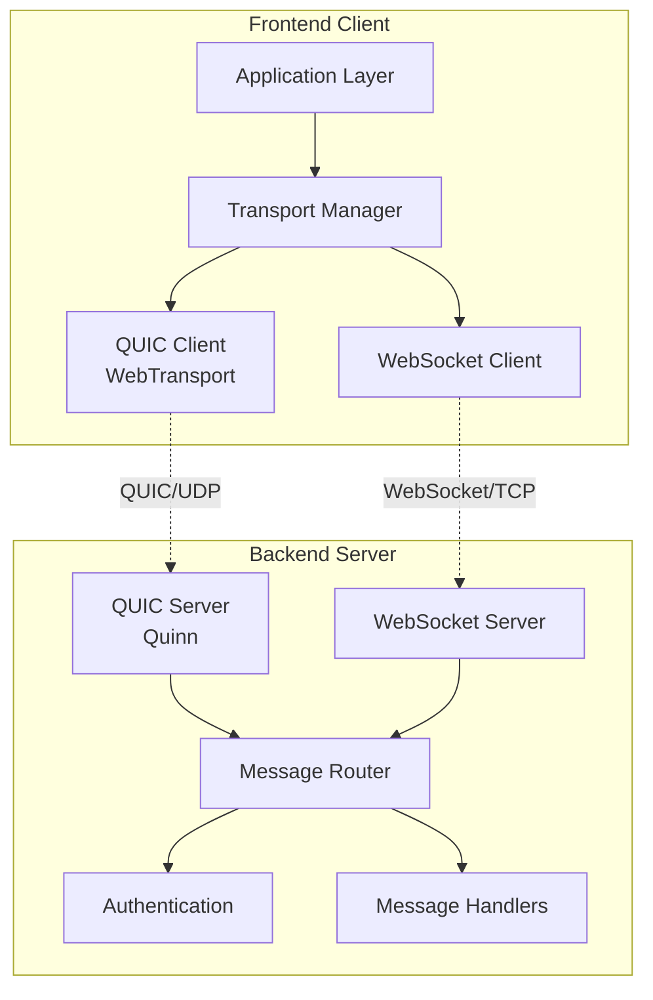
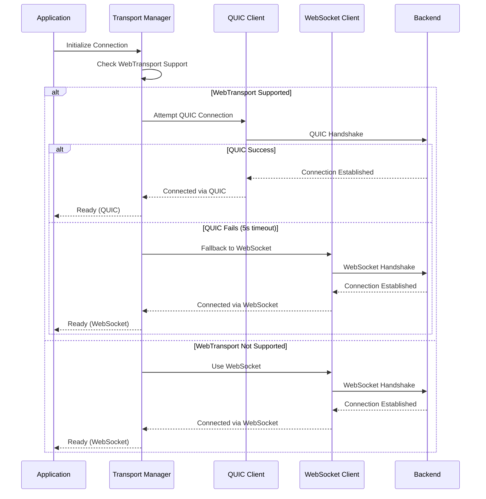

# Design Document: QUIC Transport

## Overview

This document describes the design for adding QUIC protocol support to the messaging system. The implementation will use Quinn (a pure-Rust QUIC library) on the backend and the WebTransport API (browser-native QUIC support) on the frontend. The design maintains compatibility with existing WebSocket connections while providing improved performance through QUIC's modern transport features.

The system will support dual transport modes: clients can connect via either QUIC (preferred) or WebSocket (fallback), with automatic selection based on browser support and network conditions. Both transports will use the same message format and authentication mechanisms to ensure seamless operation.

## Architecture

### High-Level Architecture



### Transport Selection Flow



### Stream Multiplexing Strategy

QUIC connections will use multiple streams for different message types to prevent head-of-line blocking:

- **Stream 0**: Control messages (authentication, presence, typing indicators)
- **Stream 1-99**: Chat messages (one stream per active conversation, round-robin)
- **Stream 100-199**: File transfers and media
- **Stream 200+**: Bot commands and responses

## Components and Interfaces

### Backend Components

#### 1. QUIC Server (Quinn-based)

**Responsibilities:**
- Accept incoming QUIC connections on configured UDP port
- Perform TLS 1.3 handshake with client certificates
- Manage connection lifecycle and stream multiplexing
- Route incoming data to message handlers

**Key Structures:**

```rust
// backend/src/quic/server.rs
pub struct QuicServer {
    endpoint: quinn::Endpoint,
    config: QuicConfig,
    connection_manager: Arc<ConnectionManager>,
    message_router: Arc<MessageRouter>,
}

pub struct QuicConfig {
    pub bind_address: SocketAddr,
    pub max_concurrent_connections: usize,
    pub max_streams_per_connection: u64,
    pub idle_timeout: Duration,
    pub tls_config: TlsServerConfig,
}

pub struct QuicConnection {
    pub connection_id: ConnectionId,
    pub user_id: Option<UserId>,
    pub quinn_connection: quinn::Connection,
    pub streams: HashMap<StreamId, StreamType>,
    pub last_activity: Instant,
}
```

**Interface:**

```rust
impl QuicServer {
    pub async fn new(config: QuicConfig) -> Result<Self>;
    pub async fn start(&self) -> Result<()>;
    pub async fn stop(&self) -> Result<()>;
    pub async fn handle_connection(&self, conn: quinn::Connection) -> Result<()>;
    pub async fn handle_stream(&self, stream: quinn::RecvStream, send: quinn::SendStream) -> Result<()>;
}
```

#### 2. Connection Manager

**Responsibilities:**
- Track active QUIC and WebSocket connections
- Manage connection state and metadata
- Handle connection migration for QUIC
- Provide unified interface for sending messages

**Key Structures:**

```rust
// backend/src/quic/connection_manager.rs
pub struct ConnectionManager {
    connections: Arc<RwLock<HashMap<ConnectionId, Connection>>>,
    user_connections: Arc<RwLock<HashMap<UserId, Vec<ConnectionId>>>>,
}

pub enum Connection {
    Quic(QuicConnection),
    WebSocket(WebSocketConnection),
}

pub enum TransportType {
    Quic,
    WebSocket,
}
```

**Interface:**

```rust
impl ConnectionManager {
    pub fn new() -> Self;
    pub async fn register_connection(&self, conn: Connection) -> Result<ConnectionId>;
    pub async fn unregister_connection(&self, conn_id: ConnectionId) -> Result<()>;
    pub async fn get_connection(&self, conn_id: ConnectionId) -> Option<Connection>;
    pub async fn get_user_connections(&self, user_id: UserId) -> Vec<ConnectionId>;
    pub async fn send_message(&self, conn_id: ConnectionId, msg: &[u8]) -> Result<()>;
    pub async fn broadcast_to_user(&self, user_id: UserId, msg: &[u8]) -> Result<()>;
}
```

#### 3. Message Router

**Responsibilities:**
- Parse incoming messages from both transports
- Route messages to appropriate handlers
- Serialize responses for transmission
- Maintain message format compatibility

**Key Structures:**

```rust
// backend/src/quic/message_router.rs
pub struct MessageRouter {
    handlers: HashMap<MessageType, Box<dyn MessageHandler>>,
}

pub trait MessageHandler: Send + Sync {
    async fn handle(&self, msg: Message, conn_id: ConnectionId) -> Result<Response>;
}
```

**Interface:**

```rust
impl MessageRouter {
    pub fn new() -> Self;
    pub fn register_handler(&mut self, msg_type: MessageType, handler: Box<dyn MessageHandler>);
    pub async fn route_message(&self, data: &[u8], conn_id: ConnectionId) -> Result<Vec<u8>>;
}
```

#### 4. Stream Allocator

**Responsibilities:**
- Assign message types to appropriate streams
- Balance load across streams
- Handle stream lifecycle

**Key Structures:**

```rust
// backend/src/quic/stream_allocator.rs
pub struct StreamAllocator {
    stream_assignments: HashMap<MessageType, StreamRange>,
    active_streams: HashMap<ConnectionId, Vec<StreamId>>,
}

pub struct StreamRange {
    pub start: u64,
    pub end: u64,
}

pub enum StreamType {
    Control,
    ChatMessage,
    FileTransfer,
    BotCommand,
}
```

**Interface:**

```rust
impl StreamAllocator {
    pub fn new() -> Self;
    pub fn allocate_stream(&mut self, conn_id: ConnectionId, msg_type: MessageType) -> StreamId;
    pub fn get_stream_type(&self, stream_id: StreamId) -> StreamType;
    pub fn release_stream(&mut self, conn_id: ConnectionId, stream_id: StreamId);
}
```

### Frontend Components

#### 1. Transport Manager

**Responsibilities:**
- Detect WebTransport support in browser
- Attempt QUIC connection with fallback to WebSocket
- Provide unified message interface to application
- Handle reconnection logic

**Key Structures:**

```typescript
// src/services/transport-manager.ts
export class TransportManager {
  private transport: QuicTransport | WebSocketTransport | null = null;
  private transportType: TransportType = TransportType.Unknown;
  private config: TransportConfig;
  private eventEmitter: EventEmitter;
  private reconnectAttempts: number = 0;
}

export interface TransportConfig {
  quicUrl: string;
  websocketUrl: string;
  quicTimeout: number;
  maxReconnectAttempts: number;
  reconnectDelay: number;
}

export enum TransportType {
  Unknown = 'unknown',
  Quic = 'quic',
  WebSocket = 'websocket',
}

export interface TransportEvents {
  connected: (type: TransportType) => void;
  disconnected: (reason: string) => void;
  message: (data: ArrayBuffer) => void;
  error: (error: Error) => void;
}
```

**Interface:**

```typescript
export class TransportManager {
  constructor(config: TransportConfig);
  
  async connect(): Promise<void>;
  async disconnect(): Promise<void>;
  async send(data: ArrayBuffer): Promise<void>;
  
  getTransportType(): TransportType;
  isConnected(): boolean;
  
  on<K extends keyof TransportEvents>(event: K, handler: TransportEvents[K]): void;
  off<K extends keyof TransportEvents>(event: K, handler: TransportEvents[K]): void;
}
```

#### 2. QUIC Transport (WebTransport)

**Responsibilities:**
- Establish WebTransport connection to server
- Manage bidirectional streams
- Handle connection migration
- Serialize/deserialize messages

**Key Structures:**

```typescript
// src/services/quic-transport.ts
export class QuicTransport {
  private transport: WebTransport | null = null;
  private streams: Map<number, WebTransportBidirectionalStream> = new Map();
  private streamAllocator: ClientStreamAllocator;
  private url: string;
  private connected: boolean = false;
}

export class ClientStreamAllocator {
  private nextStreamId: number = 0;
  private streamTypes: Map<number, StreamType> = new Map();
}

export enum StreamType {
  Control = 'control',
  ChatMessage = 'chat',
  FileTransfer = 'file',
  BotCommand = 'bot',
}
```

**Interface:**

```typescript
export class QuicTransport {
  constructor(url: string);
  
  async connect(): Promise<void>;
  async disconnect(): Promise<void>;
  async send(data: ArrayBuffer, streamType: StreamType): Promise<void>;
  
  isConnected(): boolean;
  
  onMessage(callback: (data: ArrayBuffer) => void): void;
  onClose(callback: (reason: string) => void): void;
  onError(callback: (error: Error) => void): void;
}
```

#### 3. WebSocket Transport (Existing, Enhanced)

**Responsibilities:**
- Maintain existing WebSocket functionality
- Implement same interface as QuicTransport
- Provide seamless fallback experience

**Interface:**

```typescript
// src/services/websocket-transport.ts
export class WebSocketTransport {
  constructor(url: string);
  
  async connect(): Promise<void>;
  async disconnect(): Promise<void>;
  async send(data: ArrayBuffer): Promise<void>;
  
  isConnected(): boolean;
  
  onMessage(callback: (data: ArrayBuffer) => void): void;
  onClose(callback: (reason: string) => void): void;
  onError(callback: (error: Error) => void): void;
}
```

## Data Models

### Message Format

Both QUIC and WebSocket will use the same JSON message format for compatibility:

```typescript
interface TransportMessage {
  type: MessageType;
  id: string;
  timestamp: number;
  payload: unknown;
}

enum MessageType {
  // Authentication
  AUTH_REQUEST = 'auth_request',
  AUTH_RESPONSE = 'auth_response',
  
  // Chat messages
  CHAT_MESSAGE = 'chat_message',
  MESSAGE_ACK = 'message_ack',
  
  // Presence
  TYPING_START = 'typing_start',
  TYPING_STOP = 'typing_stop',
  USER_ONLINE = 'user_online',
  USER_OFFLINE = 'user_offline',
  
  // Bot commands
  BOT_COMMAND = 'bot_command',
  BOT_RESPONSE = 'bot_response',
  
  // File transfer
  FILE_UPLOAD_START = 'file_upload_start',
  FILE_CHUNK = 'file_chunk',
  FILE_UPLOAD_COMPLETE = 'file_upload_complete',
  
  // Control
  PING = 'ping',
  PONG = 'pong',
  ERROR = 'error',
}
```

### Connection State

```rust
// Backend
pub struct ConnectionState {
    pub connection_id: ConnectionId,
    pub user_id: Option<UserId>,
    pub transport_type: TransportType,
    pub connected_at: DateTime<Utc>,
    pub last_activity: DateTime<Utc>,
    pub bytes_sent: u64,
    pub bytes_received: u64,
    pub messages_sent: u64,
    pub messages_received: u64,
}
```

```typescript
// Frontend
interface ConnectionState {
  connectionId: string;
  transportType: TransportType;
  connectedAt: Date;
  lastActivity: Date;
  bytesSent: number;
  bytesReceived: number;
  messagesSent: number;
  messagesReceived: number;
  latency: number;
}
```

### Configuration Models

```rust
// Backend configuration
pub struct QuicServerConfig {
    pub enabled: bool,
    pub bind_address: String,
    pub port: u16,
    pub cert_path: String,
    pub key_path: String,
    pub max_connections: usize,
    pub max_streams_per_connection: u64,
    pub idle_timeout_ms: u64,
    pub keep_alive_interval_ms: u64,
}
```

```typescript
// Frontend configuration
interface QuicClientConfig {
  enabled: boolean;
  serverUrl: string;
  connectionTimeout: number;
  fallbackToWebSocket: boolean;
  retryAttempts: number;
  retryDelay: number;
}
```

## Correctness Properties

*A property is a characteristic or behavior that should hold true across all valid executions of a system—essentially, a formal statement about what the system should do. Properties serve as the bridge between human-readable specifications and machine-verifiable correctness guarantees.*


### Property 1: Connection Handshake Establishment
*For any* valid client connection attempt, the QUIC transport should successfully perform the TLS 1.3 handshake and establish a secure connection with certificate verification.
**Validates: Requirements 1.2, 7.1, 7.2**

### Property 2: Authentication Consistency
*For any* authentication token, both QUIC and WebSocket transports should apply the same authentication logic and produce identical authentication results.
**Validates: Requirements 1.3, 7.3**

### Property 3: Connection State Maintenance
*For any* active QUIC connection, the transport should maintain connection state and send keep-alive packets at configured intervals without connection drops.
**Validates: Requirements 1.4**

### Property 4: Message Routing Correctness
*For any* valid message received on either QUIC or WebSocket transport, the backend should parse it using the same message handlers and route it to the correct handler based on message type.
**Validates: Requirements 1.5, 6.2**

### Property 5: Resource Cleanup on Error
*For any* connection error or failure, the transport should log the error and completely clean up all associated connection resources (streams, buffers, state).
**Validates: Requirements 1.6**

### Property 6: Message Serialization Round-Trip
*For any* message object, serializing it for QUIC transmission and then deserializing it should produce an equivalent message object, and this should use the same JSON format as WebSocket.
**Validates: Requirements 2.3, 2.4, 6.1**

### Property 7: Connection Health Monitoring
*For any* active connection, the client should continuously monitor connection health and detect failures within a reasonable timeout period (e.g., 10 seconds).
**Validates: Requirements 2.5**

### Property 8: Automatic Reconnection and Fallback
*For any* QUIC connection failure, the client should either attempt to reconnect via QUIC or fall back to WebSocket within the configured timeout (5 seconds), ensuring continuous connectivity.
**Validates: Requirements 2.6, 5.3, 10.2**

### Property 9: Stream Type Segregation
*For any* set of messages with different message types (control, chat, file, bot), the QUIC transport should assign them to separate stream ranges according to the stream allocation strategy.
**Validates: Requirements 3.1**

### Property 10: Stream Independence
*For any* QUIC connection with multiple active streams, delays or blocking on one stream should not prevent other streams from processing messages concurrently.
**Validates: Requirements 3.2**

### Property 11: Stream Lifecycle Independence
*For any* QUIC connection, closing an individual stream should not affect the connection state or other active streams on the same connection.
**Validates: Requirements 3.3**

### Property 12: Connection Migration State Preservation
*For any* network path change that triggers connection migration, the QUIC transport should preserve all session state, maintain message ordering, and resume transmission without data loss.
**Validates: Requirements 4.1, 4.2, 4.3**

### Property 13: Migration Failure Notification
*For any* connection migration failure, the transport should notify the application layer to initiate reconnection procedures.
**Validates: Requirements 4.4**

### Property 14: Transport Selection Priority
*For any* client initialization where QUIC is supported, the transport manager should attempt QUIC connection before attempting WebSocket.
**Validates: Requirements 5.2**

### Property 15: Unified Transport Interface
*For any* transport type (QUIC or WebSocket), the transport manager should provide the same message interface to the application, ensuring transparent transport switching.
**Validates: Requirements 5.4**

### Property 16: Performance Metrics Collection
*For any* active connection, the transport should continuously collect and update performance metrics (throughput, latency, packet loss) during the connection lifetime.
**Validates: Requirements 5.5, 8.1**

### Property 17: Message Type Compatibility
*For any* existing message type supported by WebSocket, the QUIC transport should be able to transmit and receive that message type without modification.
**Validates: Requirements 6.3**

### Property 18: Message Queue Integrity During Transport Switch
*For any* transport switch (QUIC to WebSocket or vice versa), the message queue should ensure that no messages are lost and no messages are duplicated.
**Validates: Requirements 6.4**

### Property 19: Encryption Enforcement
*For any* data transmitted over QUIC, the transport should ensure end-to-end encryption at the transport layer using TLS 1.3.
**Validates: Requirements 7.4**

### Property 20: Diagnostic Logging on Performance Issues
*For any* detected performance issue (high latency, packet loss, connection degradation), the backend should log detailed diagnostic information including timestamps, metrics, and connection state.
**Validates: Requirements 8.2**

### Property 21: Connection Type Ratio Tracking
*For any* time period, the backend should accurately track and calculate the ratio of active QUIC connections to WebSocket connections.
**Validates: Requirements 8.4**

### Property 22: Configuration-Based Feature Toggle
*For any* configuration where QUIC is disabled, the backend should only accept WebSocket connections and reject QUIC connection attempts.
**Validates: Requirements 9.3**

### Property 23: Dynamic Configuration Application
*For any* configuration change (port, connection limits, timeouts), the backend should apply the new settings to new connections without requiring code changes or restarts.
**Validates: Requirements 9.4**

### Property 24: Fast Failure Detection
*For any* network condition where QUIC is blocked (firewall, policy), the client should detect the failure and initiate fallback within the configured timeout period.
**Validates: Requirements 10.1**

### Property 25: Transport Preference Caching
*For any* QUIC connection failure on a restricted network, the client should cache the transport preference (WebSocket) and use it for subsequent connection attempts until the cache expires or network conditions change.
**Validates: Requirements 10.3**

### Property 26: Periodic QUIC Availability Retry
*For any* client using cached WebSocket preference due to previous QUIC failures, the client should periodically retry QUIC connections to detect if QUIC becomes available.
**Validates: Requirements 10.4**

## Error Handling

### Backend Error Handling

**Connection Errors:**
- Invalid handshake: Log error, close connection, return error to client
- Authentication failure: Log attempt, close connection, increment rate limit counter
- Certificate validation failure: Log error, reject connection
- Resource exhaustion: Log error, reject new connections, alert monitoring

**Stream Errors:**
- Stream reset: Log error, close affected stream, maintain connection
- Parse error: Log error, send error response, close stream
- Handler error: Log error with stack trace, send error response
- Timeout: Log warning, close stream, maintain connection

**Migration Errors:**
- Path validation failure: Log error, attempt fallback path
- State synchronization failure: Log error, close connection
- Timeout during migration: Log error, close connection

### Frontend Error Handling

**Connection Errors:**
- QUIC not supported: Silently fall back to WebSocket
- Connection timeout: Retry with exponential backoff, then fall back
- Certificate error: Log error, fall back to WebSocket
- Network unreachable: Queue messages, attempt reconnection

**Message Errors:**
- Serialization error: Log error, drop message, notify user
- Send failure: Queue message, retry on reconnection
- Receive error: Log error, request retransmission
- Invalid message format: Log error, ignore message

**Transport Switch Errors:**
- Queue overflow during switch: Drop oldest messages, log warning
- State synchronization failure: Reset state, reconnect
- Duplicate message detection: Deduplicate based on message ID

### Error Recovery Strategies

1. **Automatic Retry**: Connection failures trigger automatic retry with exponential backoff (1s, 2s, 4s, 8s, max 30s)
2. **Graceful Degradation**: QUIC failures fall back to WebSocket transparently
3. **Message Queuing**: Messages are queued during disconnection and sent on reconnection
4. **State Reconciliation**: On reconnection, client requests state sync from server
5. **Circuit Breaker**: After 5 consecutive failures, pause retry attempts for 5 minutes

## Testing Strategy

### Unit Testing

Unit tests will verify specific components and edge cases:

**Backend Unit Tests:**
- QUIC server initialization with various configurations
- Connection manager registration/unregistration
- Message router parsing and routing logic
- Stream allocator assignment logic
- Error handling for invalid inputs
- Configuration loading and validation

**Frontend Unit Tests:**
- Transport manager initialization and feature detection
- QUIC transport connection establishment
- WebSocket transport fallback logic
- Message serialization/deserialization
- Stream allocator client-side logic
- Error handling and recovery

### Property-Based Testing

Property tests will verify universal correctness properties across many generated inputs. Each test will run a minimum of 100 iterations with randomized inputs.

**Backend Property Tests:**
- Property 1: Connection handshake with random valid client configurations
- Property 2: Authentication consistency with random tokens across both transports
- Property 3: Connection state maintenance with random keep-alive intervals
- Property 4: Message routing with random message types and payloads
- Property 5: Resource cleanup with random error conditions
- Property 12: Connection migration with random network path changes
- Property 18: Message queue integrity with random transport switches
- Property 21: Connection ratio tracking with random connection patterns

**Frontend Property Tests:**
- Property 6: Message serialization round-trip with random message objects
- Property 7: Connection health monitoring with random failure scenarios
- Property 8: Automatic reconnection with random failure types
- Property 9: Stream type segregation with random message type sequences
- Property 15: Unified interface with random transport types
- Property 25: Transport preference caching with random failure patterns

### Integration Testing

Integration tests will verify end-to-end functionality:

**QUIC Connection Flow:**
1. Start backend server with QUIC enabled
2. Connect frontend client via QUIC
3. Authenticate user
4. Send various message types
5. Verify messages received correctly
6. Disconnect and verify cleanup

**Fallback Flow:**
1. Start backend with QUIC disabled
2. Attempt QUIC connection from frontend
3. Verify automatic fallback to WebSocket
4. Verify message transmission works
5. Verify transport preference is cached

**Migration Flow:**
1. Establish QUIC connection
2. Simulate network path change
3. Verify connection migrates successfully
4. Verify no message loss during migration
5. Verify state is preserved

**Transport Switch Flow:**
1. Connect via QUIC
2. Send messages
3. Force transport switch to WebSocket
4. Verify message queue integrity
5. Verify no duplicates or losses

### Performance Testing

Performance tests will measure system behavior under load:

**Throughput Test:**
- Measure messages per second for QUIC vs WebSocket
- Test with varying message sizes (100B, 1KB, 10KB, 100KB)
- Compare latency distributions

**Concurrency Test:**
- Test with 100, 1000, 10000 concurrent connections
- Measure CPU and memory usage
- Verify stream multiplexing efficiency

**Migration Test:**
- Measure migration time under various conditions
- Test with active message transmission during migration
- Verify zero data loss

**Fallback Test:**
- Measure fallback time from QUIC to WebSocket
- Test under various failure scenarios
- Verify user experience remains smooth

### Testing Tools and Frameworks

**Backend (Rust):**
- Unit tests: Built-in Rust test framework
- Property tests: `proptest` or `quickcheck` crate
- Integration tests: `tokio-test` for async testing
- Load testing: Custom load generator using `tokio`

**Frontend (TypeScript):**
- Unit tests: Jest
- Property tests: `fast-check` library
- Integration tests: Playwright or Cypress
- E2E tests: Playwright with real backend

### Test Configuration

All property-based tests must:
- Run minimum 100 iterations per test
- Use appropriate generators for input types
- Include shrinking to find minimal failing cases
- Tag tests with feature name and property number
- Reference the design document property

Example test tag format:
```rust
// Feature: quic-transport, Property 4: Message Routing Correctness
// Validates: Requirements 1.5, 6.2
```

```typescript
// Feature: quic-transport, Property 6: Message Serialization Round-Trip
// Validates: Requirements 2.3, 2.4, 6.1
```

## Implementation Notes

### Technology Stack

**Backend:**
- QUIC Library: Quinn (https://github.com/quinn-rs/quinn)
- TLS: rustls with ring for cryptography
- Async Runtime: tokio
- Serialization: serde_json

**Frontend:**
- QUIC API: WebTransport (browser native)
- Fallback: WebSocket API
- Serialization: JSON.stringify/parse
- State Management: Existing Zustand stores

### Dependencies

**Backend (Cargo.toml additions):**
```toml
[dependencies]
quinn = "0.11"
rustls = "0.23"
tokio = { version = "1.35", features = ["full"] }
serde = { version = "1.0", features = ["derive"] }
serde_json = "1.0"
```

**Frontend (package.json additions):**
```json
{
  "devDependencies": {
    "@types/dom-webcodecs": "^0.1.11"
  }
}
```

### Configuration Files

**Backend (.env additions):**
```env
# QUIC Configuration
QUIC_ENABLED=true
QUIC_BIND_ADDRESS=0.0.0.0
QUIC_PORT=4433
QUIC_CERT_PATH=./certs/server.crt
QUIC_KEY_PATH=./certs/server.key
QUIC_MAX_CONNECTIONS=10000
QUIC_MAX_STREAMS_PER_CONNECTION=100
QUIC_IDLE_TIMEOUT_MS=30000
QUIC_KEEP_ALIVE_INTERVAL_MS=5000
```

**Frontend (.env additions):**
```env
# QUIC Configuration
VITE_QUIC_ENABLED=true
VITE_QUIC_URL=https://localhost:4433
VITE_QUIC_TIMEOUT=5000
VITE_QUIC_FALLBACK_ENABLED=true
```

### Security Considerations

1. **Certificate Management**: Use Let's Encrypt or similar for production certificates
2. **Token Validation**: Reuse existing JWT validation logic for both transports
3. **Rate Limiting**: Apply same rate limits to QUIC as WebSocket
4. **DDoS Protection**: Implement connection limits and rate limiting at QUIC layer
5. **Encryption**: Enforce TLS 1.3 minimum, disable older protocols

### Performance Optimizations

1. **Zero-Copy**: Use `bytes::Bytes` for zero-copy message passing
2. **Connection Pooling**: Reuse QUIC connections for multiple streams
3. **Batch Processing**: Batch small messages to reduce overhead
4. **Compression**: Consider message compression for large payloads
5. **Stream Prioritization**: Prioritize control messages over bulk data

### Monitoring and Observability

**Metrics to Track:**
- Active QUIC connections count
- Active WebSocket connections count
- Messages per second (QUIC vs WebSocket)
- Average latency (QUIC vs WebSocket)
- Connection migration success rate
- Fallback rate (QUIC to WebSocket)
- Error rates by type
- Resource usage (CPU, memory, network)

**Logging:**
- Connection lifecycle events (connect, disconnect, migrate)
- Authentication attempts and results
- Error conditions with full context
- Performance warnings (high latency, packet loss)
- Configuration changes

### Deployment Strategy

**Phase 1: Backend Implementation**
1. Implement QUIC server with Quinn
2. Add connection manager
3. Integrate with existing message router
4. Add configuration and monitoring
5. Test with synthetic clients

**Phase 2: Frontend Implementation**
1. Implement transport manager
2. Add QUIC transport with WebTransport
3. Enhance WebSocket transport for unified interface
4. Add fallback logic
5. Test with backend

**Phase 3: Integration and Testing**
1. End-to-end integration tests
2. Performance testing and optimization
3. Security audit
4. Load testing

**Phase 4: Gradual Rollout**
1. Deploy to staging environment
2. Enable for internal users (10%)
3. Monitor metrics and errors
4. Gradually increase to 50%, then 100%
5. Monitor and optimize based on real-world usage

### Rollback Plan

If issues are detected:
1. Disable QUIC via configuration (set `QUIC_ENABLED=false`)
2. All clients will fall back to WebSocket automatically
3. No code deployment needed for rollback
4. Investigate and fix issues
5. Re-enable QUIC when ready

## References

- [QUIC Protocol RFC 9000](https://www.rfc-editor.org/rfc/rfc9000.html)
- [Quinn Documentation](https://docs.rs/quinn/)
- [WebTransport API](https://developer.mozilla.org/en-US/docs/Web/API/WebTransport_API)
- [HTTP/3 RFC 9114](https://www.rfc-editor.org/rfc/rfc9114.html)

*Content was rephrased for compliance with licensing restrictions*
