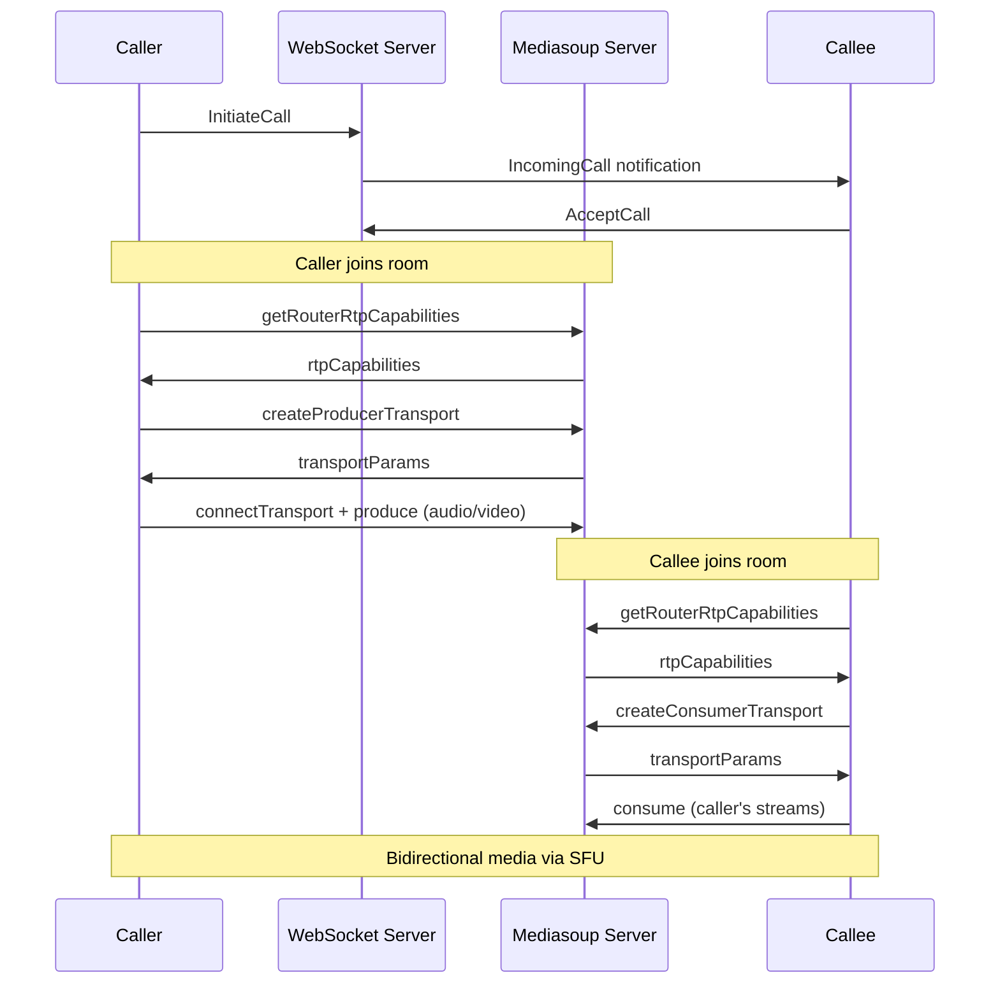
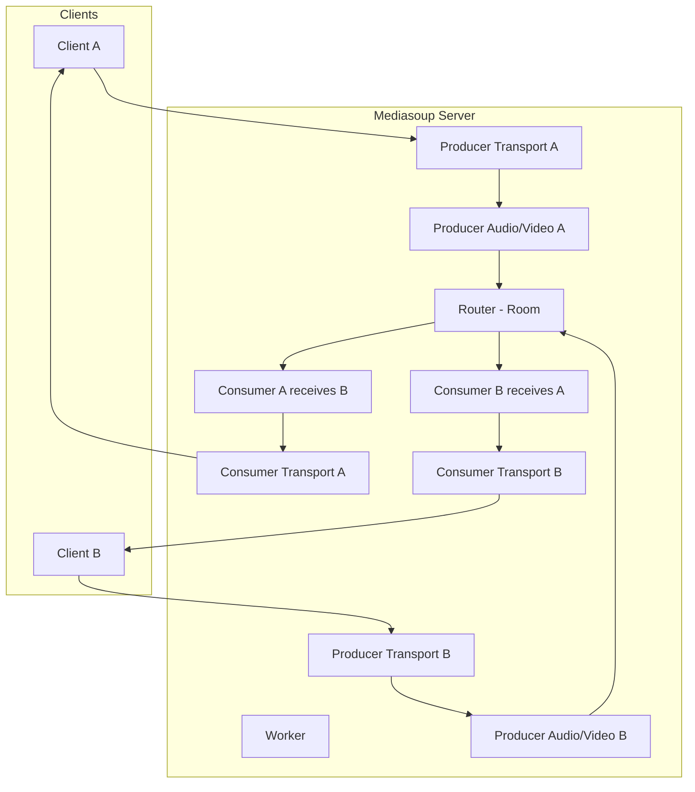
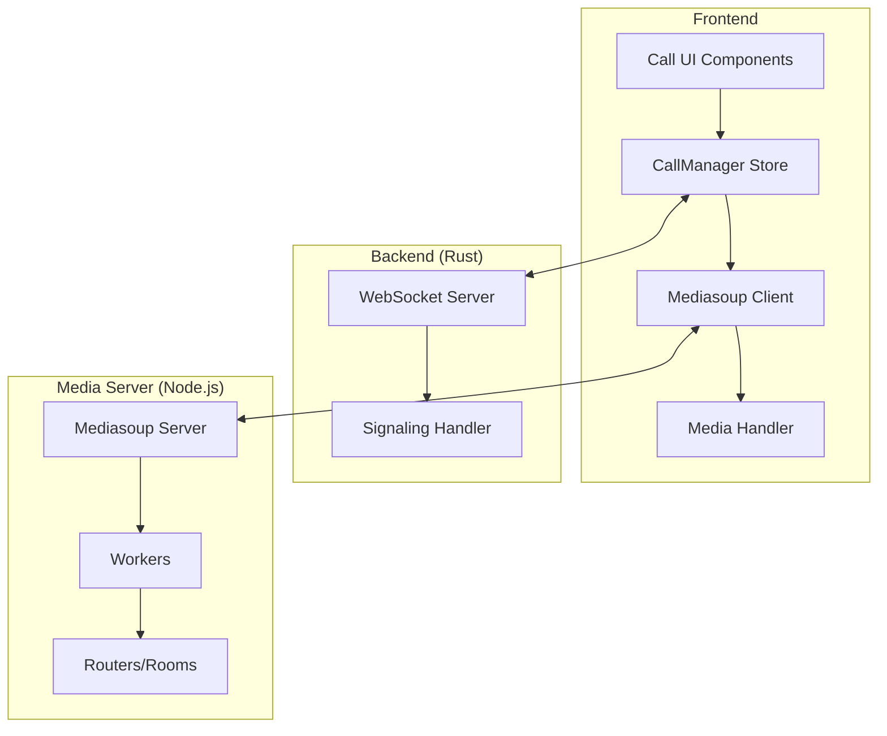
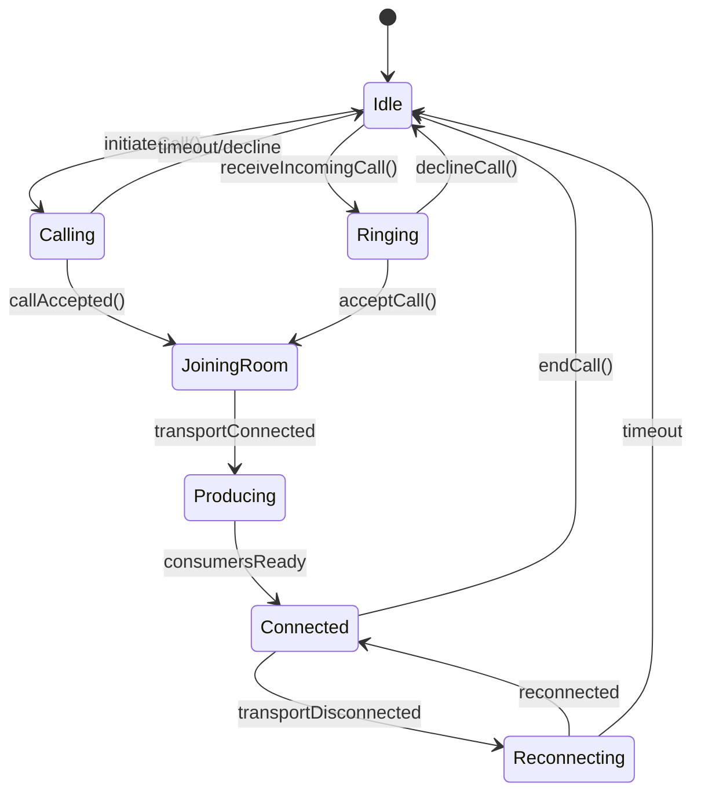

# Design Document: Voice & Video Calling

## Overview

Tính năng gọi điện sử dụng **mediasoup** - một SFU (Selective Forwarding Unit) server để xử lý media streams. Kiến trúc này cho phép scalability tốt hơn, hỗ trợ group calls trong tương lai, và giảm bandwidth cho clients.

### High-Level Architecture



### Mediasoup Architecture



## Architecture

### Component Diagram



### State Machine



## Components and Interfaces

### 1. Mediasoup Client Service (`src/services/mediasoup.ts`)

```typescript
import { Device, Transport, Producer, Consumer } from 'mediasoup-client/lib/types';

interface MediasoupConfig {
  serverUrl: string; // Mediasoup signaling server URL
}

interface MediasoupService {
  // Device setup
  device: Device;
  loadDevice(routerRtpCapabilities: RtpCapabilities): Promise<void>;
  
  // Transport management
  producerTransport: Transport | null;
  consumerTransport: Transport | null;
  createProducerTransport(): Promise<void>;
  createConsumerTransport(): Promise<void>;
  
  // Producing (sending media)
  producers: Map<string, Producer>; // 'audio' | 'video' -> Producer
  produce(track: MediaStreamTrack, kind: 'audio' | 'video'): Promise<Producer>;
  pauseProducer(kind: 'audio' | 'video'): void;
  resumeProducer(kind: 'audio' | 'video'): void;
  closeProducer(kind: 'audio' | 'video'): void;
  
  // Consuming (receiving media)
  consumers: Map<string, Consumer>; // consumerId -> Consumer
  consume(producerId: string, kind: 'audio' | 'video'): Promise<Consumer>;
  
  // Room management
  joinRoom(roomId: string): Promise<void>;
  leaveRoom(): Promise<void>;
  
  // Cleanup
  close(): void;
}
```

### 2. Media Handler (`src/services/mediaHandler.ts`)

```typescript
interface MediaConstraints {
  audio: boolean | MediaTrackConstraints;
  video: boolean | MediaTrackConstraints;
}

interface MediaHandler {
  // Get user media
  getUserMedia(constraints: MediaConstraints): Promise<MediaStream>;
  getDisplayMedia(): Promise<MediaStream>;
  
  // Track control
  toggleAudio(enabled: boolean): void;
  toggleVideo(enabled: boolean): void;
  replaceVideoTrack(newTrack: MediaStreamTrack): Promise<void>;
  
  // Cleanup
  stopAllTracks(): void;
  
  // State
  localStream: MediaStream | null;
  audioTrack: MediaStreamTrack | null;
  videoTrack: MediaStreamTrack | null;
}
```

### 3. Call Manager Store (`src/stores/callStore.ts`)

```typescript
type CallState = 'idle' | 'calling' | 'ringing' | 'joining' | 'producing' | 'connected' | 'reconnecting';
type CallType = 'voice' | 'video';

interface CallInfo {
  id: string;
  roomId: string;
  type: CallType;
  remoteUserId: string;
  remoteUserName: string;
  remoteUserAvatar: string;
  chatId: string;
  isIncoming: boolean;
  startTime?: Date;
}

interface RemoteParticipant {
  oderId: string;
  name: string;
  avatar: string;
  audioConsumer?: Consumer;
  videoConsumer?: Consumer;
  audioEnabled: boolean;
  videoEnabled: boolean;
}

interface CallStore {
  // State
  callState: CallState;
  currentCall: CallInfo | null;
  localStream: MediaStream | null;
  remoteParticipants: Map<string, RemoteParticipant>;
  
  // Media state
  isMuted: boolean;
  isVideoOff: boolean;
  isScreenSharing: boolean;
  
  // Actions
  initiateCall(userId: string, chatId: string, type: CallType): Promise<void>;
  acceptCall(): Promise<void>;
  declineCall(): void;
  endCall(): void;
  
  // Media controls
  toggleMute(): void;
  toggleVideo(): void;
  toggleScreenShare(): Promise<void>;
  
  // Mediasoup handlers
  handleRoomJoined(data: RoomJoinedData): void;
  handleNewProducer(data: NewProducerData): void;
  handleProducerClosed(data: ProducerClosedData): void;
  handleCallEnd(data: CallEndData): void;
}
```

### 4. Mediasoup Server (Node.js - Separate Service)

```typescript
// media-server/src/server.ts
import * as mediasoup from 'mediasoup';

interface Room {
  id: string;
  router: mediasoup.types.Router;
  participants: Map<string, Participant>;
}

interface Participant {
  oderId: string;
  producerTransport?: mediasoup.types.WebRtcTransport;
  consumerTransport?: mediasoup.types.WebRtcTransport;
  producers: Map<string, mediasoup.types.Producer>;
  consumers: Map<string, mediasoup.types.Consumer>;
}

// Server handles:
// - Worker management
// - Router (room) creation
// - Transport creation and connection
// - Producer/Consumer management
// - Signaling via WebSocket
```

### 5. Signaling Events (Backend Extension)

```rust
// New events to add to ServerEvent enum
pub enum ServerEvent {
    // ... existing events ...
    
    /// Incoming call notification
    IncomingCall {
        #[serde(rename = "callId")]
        call_id: Uuid,
        #[serde(rename = "callerId")]
        caller_id: Uuid,
        #[serde(rename = "callerName")]
        caller_name: String,
        #[serde(rename = "callerAvatar")]
        caller_avatar: Option<String>,
        #[serde(rename = "chatId")]
        chat_id: Uuid,
        #[serde(rename = "callType")]
        call_type: String, // "voice" | "video"
    },
    
    /// Call accepted - both parties should join mediasoup room
    CallAccepted {
        #[serde(rename = "callId")]
        call_id: Uuid,
        #[serde(rename = "roomId")]
        room_id: String,
        #[serde(rename = "mediasoupUrl")]
        mediasoup_url: String,
    },
    
    /// Call declined
    CallDeclined {
        #[serde(rename = "callId")]
        call_id: Uuid,
    },
    
    /// Call ended
    CallEnded {
        #[serde(rename = "callId")]
        call_id: Uuid,
        reason: String, // "ended" | "timeout" | "error"
    },
    
    /// User busy (already in another call)
    UserBusy {
        #[serde(rename = "callId")]
        call_id: Uuid,
    },
}

// New events to add to ClientEvent enum
pub enum ClientEvent {
    // ... existing events ...
    
    /// Initiate a call
    InitiateCall {
        #[serde(rename = "targetUserId")]
        target_user_id: Uuid,
        #[serde(rename = "chatId")]
        chat_id: Uuid,
        #[serde(rename = "callType")]
        call_type: String,
    },
    
    /// Accept incoming call
    AcceptCall {
        #[serde(rename = "callId")]
        call_id: Uuid,
    },
    
    /// Decline incoming call
    DeclineCall {
        #[serde(rename = "callId")]
        call_id: Uuid,
    },
    
    /// End ongoing call
    EndCall {
        #[serde(rename = "callId")]
        call_id: Uuid,
    },
}
```

## Data Models

### Call Session (In-Memory on Backend)

```typescript
interface CallSession {
  id: string;
  roomId: string; // Mediasoup room ID
  callerId: string;
  calleeId: string;
  chatId: string;
  type: CallType;
  state: 'pending' | 'active' | 'ended';
  createdAt: Date;
  connectedAt?: Date;
  endedAt?: Date;
}
```

### Mediasoup Room (On Media Server)

```typescript
interface MediasoupRoom {
  id: string;
  router: Router;
  participants: Map<string, {
    oderId: string;
    producerTransport?: WebRtcTransport;
    consumerTransport?: WebRtcTransport;
    producers: Map<string, Producer>;
    consumers: Map<string, Consumer>;
  }>;
  createdAt: Date;
}
```

### Environment Configuration

```env
# .env.local (Frontend)
VITE_MEDIASOUP_URL=wss://media.your-domain.com

# media-server/.env (Mediasoup Server)
MEDIASOUP_LISTEN_IP=0.0.0.0
MEDIASOUP_ANNOUNCED_IP=your-public-ip
MEDIASOUP_MIN_PORT=40000
MEDIASOUP_MAX_PORT=49999
TURN_SERVER_URL=turn:your-turn-server.com:3478
TURN_USERNAME=your-username
TURN_CREDENTIAL=your-credential
```

## Correctness Properties

*A property is a characteristic or behavior that should hold true across all valid executions of a system-essentially, a formal statement about what the system should do. Properties serve as the bridge between human-readable specifications and machine-verifiable correctness guarantees.*

### Property 1: Call initiation creates correct request based on call type

*For any* call type (voice or video), when initiateCall is called, the Call_Manager SHALL create a call request with the matching type and notify the callee.

**Validates: Requirements 1.1, 1.2**

### Property 2: Media constraints match call type

*For any* call initiation, voice calls SHALL request only audio permission, and video calls SHALL request both audio and video permissions.

**Validates: Requirements 1.3**

### Property 3: Accepting call triggers room join

*For any* incoming call that is accepted, both caller and callee SHALL receive room credentials and join the same mediasoup room.

**Validates: Requirements 2.3, 3.1**

### Property 4: Declining call sends decline signal

*For any* incoming call that is declined, the Call_Manager SHALL send a decline signal to the caller and return to idle state.

**Validates: Requirements 2.4**

### Property 5: Producer/Consumer pairing

*For any* participant producing media in a room, all other participants SHALL be able to consume that media stream.

**Validates: Requirements 3.2, 3.3**

### Property 6: Transport connection state consistency

*For any* transport state change, the call state SHALL reflect the transport connection status accurately.

**Validates: Requirements 3.6**

### Property 7: Media track toggle changes producer state

*For any* media track (audio or video), toggling its state SHALL pause or resume the corresponding producer.

**Validates: Requirements 4.1, 4.2**

### Property 8: Call end triggers cleanup

*For any* call end event, all transports, producers, and consumers SHALL be closed and the room SHALL be cleaned up if empty.

**Validates: Requirements 5.1, 5.2**

### Property 9: Signaling messages route to correct peer

*For any* call signaling message (initiate, accept, decline, end), it SHALL be delivered only to the intended recipient.

**Validates: Requirements 6.1, 6.2, 6.3**

### Property 10: Calls require existing chat between users

*For any* call attempt, if no chat exists between caller and callee, the signaling server SHALL reject the call with an error.

**Validates: Requirements 6.5**

## Error Handling

### Connection Errors

| Error Type | Handling Strategy |
|------------|-------------------|
| Media permission denied | Display error, cancel call, return to idle |
| Peer connection failed | Display error, offer retry option |
| ICE connection timeout | Attempt reconnection for 10s, then end call |
| Signaling error | Display error message, end call |
| User offline | Return "user unavailable" error |

### Reconnection Strategy

```typescript
const RECONNECTION_TIMEOUT = 10000; // 10 seconds

// When ICE connection state becomes "disconnected"
// 1. Set call state to "reconnecting"
// 2. Start reconnection timer
// 3. If ICE reconnects within timeout, resume call
// 4. If timeout expires, end call gracefully
```

## Testing Strategy

### Unit Tests

Unit tests focus on specific examples and edge cases:

- Call state transitions (idle → calling → connecting → connected)
- Media permission handling (granted vs denied)
- Signaling message format validation
- Timeout behavior (30s incoming call timeout)
- Error handling scenarios

### Property-Based Tests

Property-based tests verify universal properties across all inputs using a PBT library (e.g., fast-check for TypeScript):

- **Minimum 100 iterations per property test**
- Each test tagged with: **Feature: voice-video-calling, Property {N}: {property_text}**

```typescript
// Example property test structure
describe('Voice Video Calling Properties', () => {
  it('Property 2: Media constraints match call type', () => {
    fc.assert(
      fc.property(
        fc.constantFrom('voice', 'video'),
        (callType) => {
          const constraints = getMediaConstraints(callType);
          if (callType === 'voice') {
            return constraints.audio === true && constraints.video === false;
          } else {
            return constraints.audio === true && constraints.video === true;
          }
        }
      ),
      { numRuns: 100 }
    );
  });
});
```

### Integration Tests

- Full call flow: initiate → accept → connect → end
- Signaling message routing between two clients
- WebSocket event handling for call events

