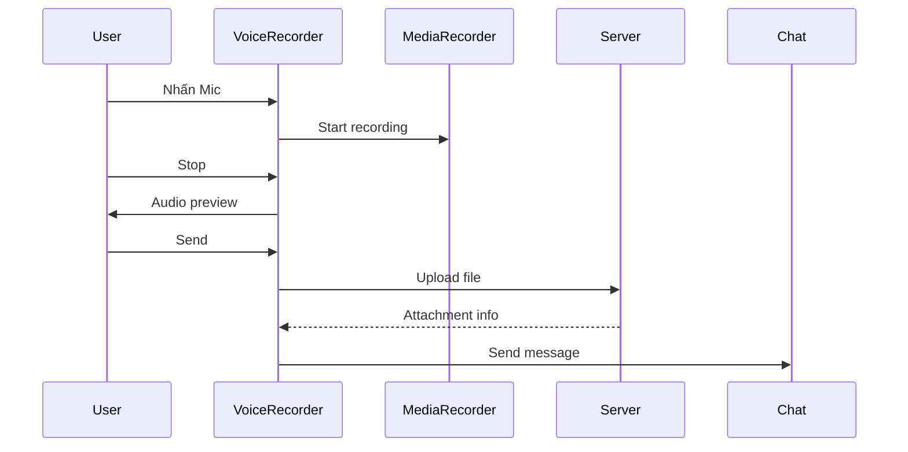

# Tính năng Voice Recording

Upload file ghi âm lên server và gửi như tin nhắn.

## Cách sử dụng

1. Nhấn nút **Mic** (khi không có text)
2. Cho phép truy cập microphone
3. Nhấn nút **Mic đỏ** để bắt đầu ghi
4. Nhấn **Stop** để dừng
5. Nghe lại audio preview
6. Nhấn **Send** để gửi

## Định dạng hỗ trợ

- mp3
- wav
- ogg
- m4a
- webm (từ MediaRecorder API)

## API

```http
POST /api/v1/upload
Content-Type: multipart/form-data

file: <audio file>
type: voice
```

**Giới hạn**: Max 500MB

## Luồng hoạt động



## Lợi ích

- **Persistent Storage**: File không mất khi reload
- **Sharing**: URL có thể chia sẻ
- **Security**: Server validate file
